# 1장 사용자 수에 따른 규모 확장성

## 단일 서버

1명

웹 앱, DB, Cache 전부 서버 한 대에서 실행됨

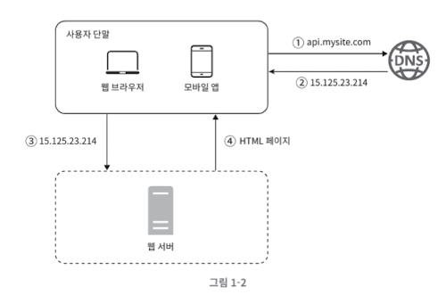

## DB

RDB 외에도 비관계형 DB가 바람직한 상황

1. 아주 낮은 응답 지연시간이 요구됨
2. 다루는 데이터가 비정형이라 관계형이 아님
3. 데이터를 직렬화하거나 역직렬화 할 수 있기만 하면 됨
4. 아주 많은 양의 데이터를 저장할 필요가 있음

## 수직적 규모 확장 VS 수평적 규모 확장

수직적 규모 확장(스케일 업) : 더 좋은 CPU, RAM 사용

- 무한대로 증설 불가. 자동복구, 다중화 방안 X
- 장애 발생시 완전히 중단

## 로드밸런서

자동 복구 문제 해소.

가용성 향상

전체 다운 방지

## DB 다중화

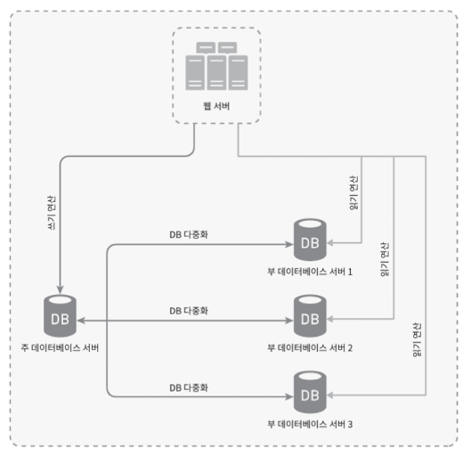

쓰기 연산 → 주 DB. (master) DB

읽기 연산 → 부 DB. (slave) DB

성능: 병렬로 처리될 수 있는 query가 늘어나 성능이 좋아짐

안정성: DB가 파괴되어도 데이터는 보존됨

가용성: DB가 장애 발생해도 서비스 가능

서버 다운 상황

부 DB 다운 → 새로운 부 DB가 즉시 실행 및 다른 부 DB가 트래픽 대체

주 DB 다운 → 다른 부 DB가 새로운 주 서버로 승격. 없는 데이터는 복구 스크립트를 돌려서 추가

## 로드밸런서와 DB 다중화 적용

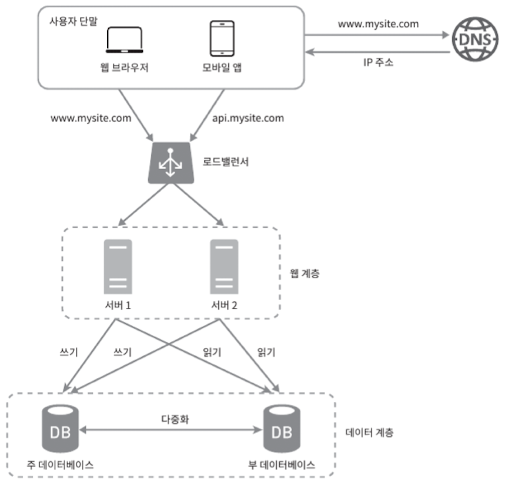

# 캐시

값비싼 연산 결과 또는 자주 참조되는 데이터를 메모리에 저장하고 사용하는 것

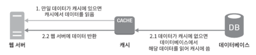

## 캐시에 있는 데이터의 유효 길이에 따른 결과

너무 짧다면 → 캐시를 읽지도 못하고 DB로 매번 요청함

너무 길다면 → 실제 값과 차이남

## 일관성

만약 캐시와 DB가 단일 트랜잭션이 아니라면 ? 데이터 일관성을 만족시킬 수 있는가 ?

## 장애

캐시 서버를 단 한대만 두는 경우 단일 장애 지점(SPOF)이 되어버릴 가능성 존재

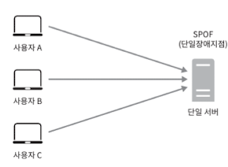

결론적으로, SPOF를 피하려면 캐시 서버를 분산시켜야함

## 분산시 고려해야할 것

캐시 메모리는 얼마나 크게?

→ 캐시 메모리가 너무 작다면 데이터가 너무 자주 캐시에서 밀려나버려 캐시의 성능이떨어질 것

데이터 방출 정책은 무엇인가?

메모리가 다 찼을 때 기존 데이터를 내보내야함. 페이지 교체 알고리즘들과 유사

→ LRU(Least Recently Used - 마지막으로 사용된 시점이 가장 오래된 데이터를 내보냄)

→ LFU(Least Frequently Used - 사용자 빈도가 가장 낮은 데이터를 내보냄)

→ FIFO(FIrst In First Out - 가장 먼저 캐시에 들어온 데이터를 내보냄)

## 콘텐츠 전송 네트워크(CDN)

정적 콘텐츠를 전송하는데 쓰는 분산된 서버의 네트워크

동적 컨텐츠 캐싱은 상대적으로 새로운 개념이라 다루지 않음.

간단하게 요약하면 요청 경로, 질의 문자열, 쿠키, 요청 헤더 등의 정보에 기반하여 HTML 페이지를 캐싱

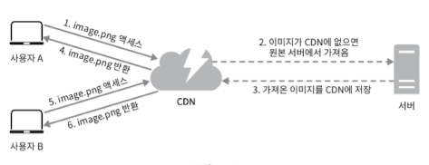

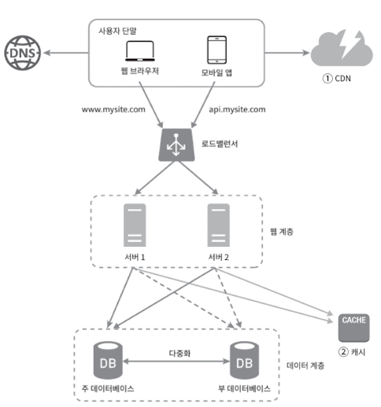

## 무상태(stateless) 웹 계층

상태를 가지고 있을 때 A 사용자의 대한 세션을 A 서버가 갖고 있다면 A 사용자에 대한 요청은 A 한테만 가야하는데, 이기능, 고정 세션(sticky session)은 로드밸런서에게 부담을 준다.

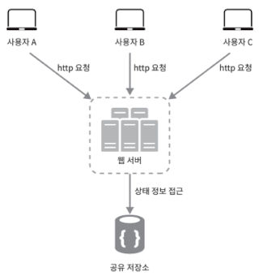

위 구조에서는 사용자로부터 HTTP 요청은 어떤 웹서버든 전달 될 수 있음

웹 서버는 상태정보가 필요할 경우 공유 저장소로부터 요청한다. 웹 서버에서 갖고있지 않는다.

무상태 웹 계층을 갖는 설계

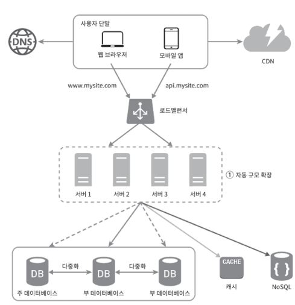

## 데이터 센터

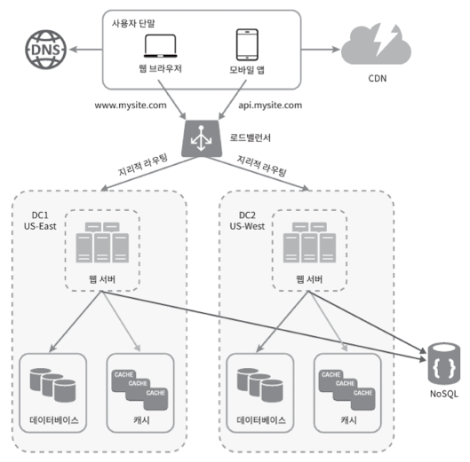

장애가 없는 상황에서 사용자는 가장 가까운 데이터 센터로 이동됨. 이를 지리적 라우팅이라 함.

만약 각 데이터 센터마다 DB를 따로 구축하고 있을 때 장애가 발생하여 대체된다면, 복구되었을 때 장애가 발생했을 때 변경한 데이터가 없을 수 있다.

넷플리스는 여러 데이터 센터에 걸쳐 데이터를 다중화한다.

## 메시지 큐

메시지의 무손실(매사자 큐에 보관된 메시지는 소비자가 꺼낼 때까지 안전히 보관된다는 특성)을 보장하는 비동기 통신을 지원하는 컴포넌트

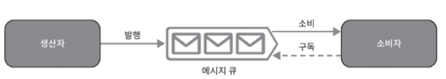

메시지 큐를 사용하면 서비스 또는 서버 간 결합이 느슨해져서 규모 확장서이 보장되어야할 때 좋다.

서버가 다운되어도 메시지 큐에다가 발행해놓고 이를 추후에 수신함

## 데이터베이스의 규모 확장

**수직적 확장**

1. 무한증설 불가
2. SPOF 위험성
3. 비용이 많이듬

수평적 확장 (샤딩(sharding))

모든 샤드는 같은 스키마를 쓰지만 데이터 사이 중복은 없음

user_id % 4 등을 사용해서 DB를 4개로 나눔

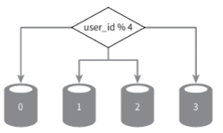

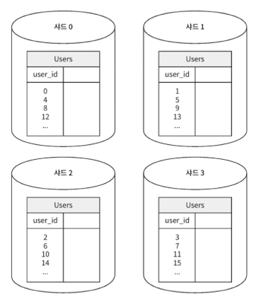

샤딩 전략을 구현할 때 가장 중요한 것은 `샤딩 키` 파티션 키라고도 부름

데이터가 어떻게 분산될지 정하는 하나 이상의 컬럼으로 구성됨

위 사진과 같은 경우 샤딩 키는 user_id

새로운 문제들

데이터의 재 샤딩(resharding)

1. 데이터가 너무 많아져서 하나의 샤드로는 더 이상 감당하기 어려울 때
2. 샤드 간 데이터 분포가 균등하지 못해서 다른 샤드에 비해 비교적 공산소모가 빠를 때

→ 5장에서 다룰 안정 해시 기법을 활용하면 문제 해결 가능

## 샤딩이 적용된 구조

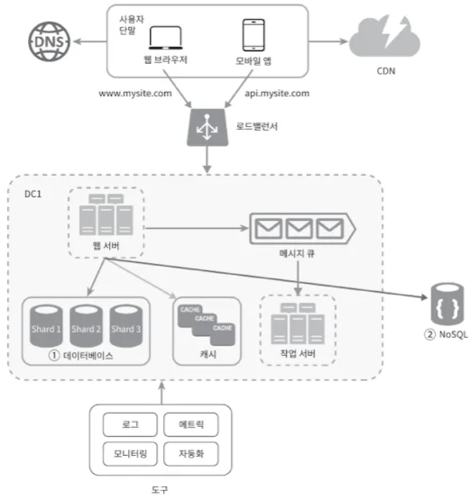

## 백만 사용자, 그 이상

- 웹 계층은 무상태 계층으로
- 모든 계층에 다중화 도입
- 가능한 한 많은 데이터를 캐시할 것
- 여러 데이터 센터를 지원할 것
- 정적 콘텐츠는 CDN을 통해 서비스할 것
- 데이터 계층은 샤딩을 통해 그 규모를 확장할 것
- 자 계층은 독립적 서비스로 분할할 것
- 시스템을 지속적으로 모니터링하고, 자동화 도구들을 활용할 것