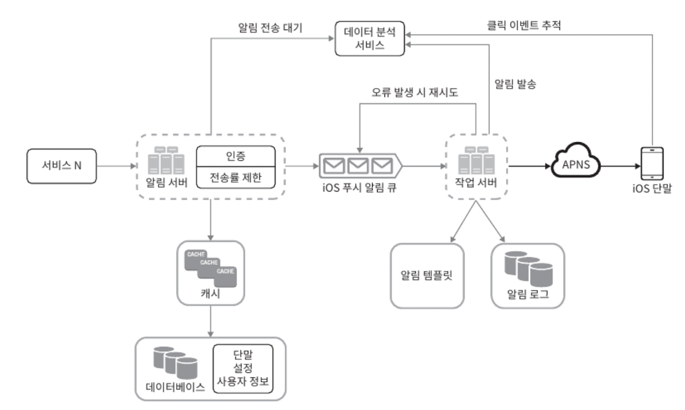

# 10장 알림

알림은 단순히 모바일 푸시 알림이 아닌 SMS 메시지, 이메일 이렇게 3가지로 분류할 수 있음

Q. 이 시스템은 어떤 종류의 알림을 지원해야 하나요?

A. 푸시 알림, SMS 메시지, 그리고 이메일입니다.

Q. 실시간(real-time) 시스템이어야 하나요?

A. 연성 실시간(soft real-ime) 시스템이라고 가정합니다. 알림은 가능한 한 빨리 전달되어야 하지만 시스템에 높은 부하가 걸렸을 때 약간의 지연은 무방합니다.

Q. 어떤 종류의 단말을 지원해야 하나요?

A. iOS 단말, android 단말, 그리고 랩톱/데스크톱을 지원해야 합니다.

Q. 사용자에게 보낼 알림은 누가 만들 수 있나요?

A. 클라이언트 애플리케이션 프로그램이 만들 수도 있구요. 서버 측에서 스케줄링 할 수도 있습니다.

Q. 사용자가 알림을 받지 않도록(opt-Out) 설정할 수도 있어야 하나요?

A. 네. 해당 설정을 마친 사용자는 더 이상 알림을 받지 않습니다.

Q. 하루에 몇 건의 알림을 보낼 수 있어야 하나요?

A. 천만 건의 모바일 푸시 알림, 백만 건의 SMS 메시지, 5백만 건의 이메일을 보낼 수 있어야 합니다.

SPOF 문제를 피해야하므로 알림 시스템 또한 분산해야함

### 첫번째 개선. 알림 큐를 디바이스별로 분리해보자.

1. 알림 서버를 증설하고 자동으로 수평적 규모 확장 가능하도록 설계
2. DB, Cache 분리
3. 큐를 분리해서 강결합 분리

알림서버 기능

1. 알림 전송 API (스팸 방지를 위해 사내 서비스에서만 호출 가능)
2. 알림 검증
3. DB or Cache에서 데이터 추출
4. 알림 전송 (큐에 삽입)

### 안정성. 데이터 손실 방지

알림이 사라지면 안됨.

알림 Log DB를 사용해서 재시도 메커니즘 구현

같은 알림이 여러 번 반복되는 것을 완전히 막는 것은 불가능함

중복을 탐지하는 메커니즘을 도입해도 해결할 수 없음

중복을 100% 제거하는데 드는 비용이 너무 큼

네트워크느 비신뢰성이라 ACK이 도착하지 않아 다시 보낼 수 있음

알림 재시도 로직

최종

