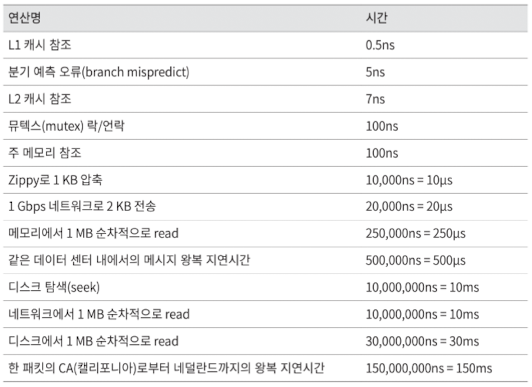
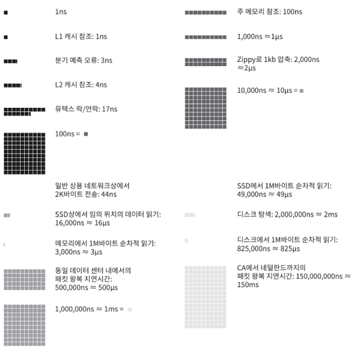

# 2장 개략적인 규모 측정

## 2의 제곱수

분산 시스템에서 다루는 데이터 양은 엄청나게 커질 수 있으나 그 계산법은 기본을 크게 벗어나지 않는다.

제대로된 결과를 얻으려면 데이터 볼륨의 단위를 2의 제곱수로 표현하면 어떻게되는 지를 알아야한다.

### 응답지연 값

## 결론

메모리는 빠르지만 디스크는 느리다.

디스크 탐색은 가능한 피하자.

단순한 압축 알고리즘은 빠르다.

데이터를 인터넷으로 전송하기 전에 가능하면 압축하자.

데이터 센터는 보통 여러 지역에 분산되어있고 센터들 간에 데이터를 주고받는 데는 시간이 걸린다.

## 가용성에 관계된 수치들

고가용성: 시스템이 오랜 시간 동안 지속적으로 중단 없이 운영될 수 있는 능력을 지칭하는 용어

고가용성을 퍼센트로 표현하는데, 100%라면 1번 도 중단된 적이 없음을 의미.

대부분의 서비스는 99 ~ 100 사이의 값을 가짐