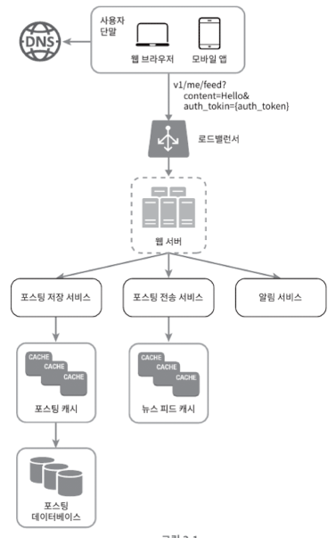
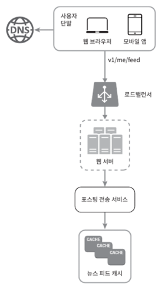
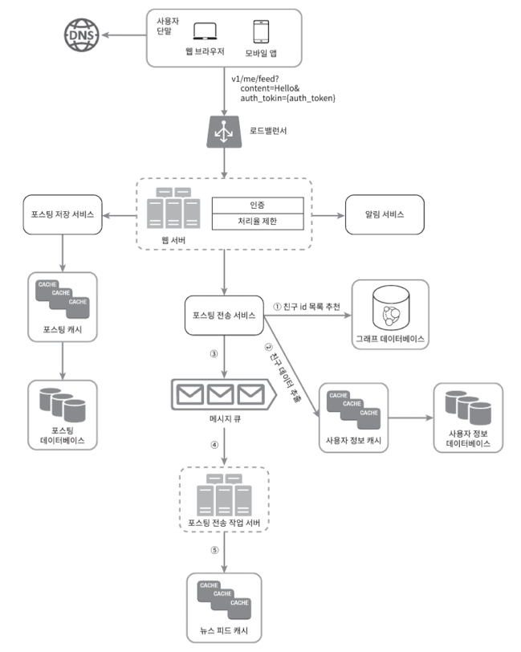
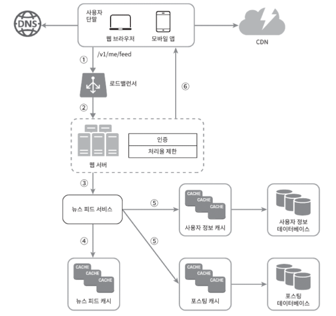

# 시스템 설계 면접 공략법

## 1. 장 소개: 시스템 설계 면접 공략법
이 장에서는 시스템 설계 면접에서 자주 마주하게 되는 도전 과제를 다룬다. 시스템 설계 문제는 예상치 못한 상황에서 주어질 수 있으며 문제의 범위가 넓기 때문에 다소 당황스러울 수 있다. 이때 중요한 것은 문제 해결 방법 그 자체보다는 어떻게 문제를 분석하고 설계하며 팀과 소통하는지에 있다.

면접에서 올바른 답을 찾는 것보다 지원자가 문제 해결 과정에서 보여주는 사고 과정과 소통 능력을 평가한다. 결국 면접관이 평가하는 핵심은 후보자가 문제를 어떻게 접근하고 어떤 전략을 통해 해결 방안을 도출하는지다.

## 2. 문제 이해 및 설계 범위 확정
첫 번째 단계에서는 문제를 정확히 이해하고 요구사항을 파악하는 것이 중요하다. 성급하게 답을 내기보다는 면접관에게 적절한 질문을 던져 요구사항을 명확히 하고 설계 범위를 확정해야 한다.

예시로 뉴스 피드 시스템 설계 문제를 받았다면 다음과 같은 질문이 유용할 것이다.

- "뉴스 피드 시스템을 모바일과 웹 앱 중 어느 쪽에 우선 적용해야 하나요?"
- "일일 활성 사용자 수(DAU)는 얼마 정도인가요?"
- "뉴스 피드의 정렬 방식은 시간순인가요 다른 기준이 있나요?"

이러한 질문을 통해 문제의 구체적인 범위를 좁히고 설계를 시작할 수 있다.

이 단계에서는 요구사항을 명확히 파악하는 것이 중요하다. 예를 들어 뉴스 피드 시스템에서는 어떤 기능이 가장 중요한지 예상 트래픽은 얼마나 될 것인지 기술 스택에 대한 고려사항은 무엇인지 파악해야 한다.

## 3. 개략적 설계안 제시 및 동의 구하기
다음 단계로 설계의 개략적인 구조를 제시한 후 면접관과 소통하며 동의를 구하는 것이 중요하다. 이때는 설계의 주요 컴포넌트와 데이터 흐름을 설명해야 하며 다이어그램을 활용하여 각 컴포넌트 간의 상호작용을 시각적으로 보여주는 것이 좋다.

처음에는 웹 서버 데이터베이스 캐시 로드 밸런서 등의 주요 요소들을 설명하는 것부터 시작한다.

위 그림에서는 웹 서버와 캐시 사이의 데이터 흐름을 간략하게 설명하고 있다. 이처럼 각 요소들의 상호작용을 면접관에게 설명하며 설계의 방향성을 논의하는 것이 중요하다. 이를 통해 면접관이 제시한 요구사항에 대해 설계가 적절한지 추가적인 요구사항이 있는지 피드백을 받을 수 있다.

## 4. 상세 설계
세부 설계 단계로 넘어가면 구체적으로 API 엔드포인트 데이터베이스 스키마 캐싱 전략 등에 대한 논의가 이루어진다. 특히 성능 최적화를 고려한 설계가 이 단계에서 중요하다. 예를 들어 뉴스 피드 시스템의 경우 뉴스 피드를 얼마나 빨리 사용자에게 제공할 수 있을지가 주요 관심사가 될 것이다.

위 다이어그램에서는 API와 데이터 흐름이 어떻게 연결되는지 설명하고 있다. 특히 병목 현상이 발생할 수 있는 부분을 미리 예측하고 이를 해결하기 위한 방안을 논의해야 한다. 캐시 전략이나 데이터베이스 분할 전략 등을 구체적으로 설명하는 것도 이 단계에서 중요한 포인트다.

### 성능 최적화 고려 사항
- 캐시 적용 범위 및 전략 설정: 실시간 데이터 제공을 위해 캐시를 어떻게 사용할지 논의한다.
- 데이터베이스 스키마 설계: 데이터의 구조화가 성능에 미치는 영향을 고려한다.
- API 요청 처리 속도 최적화: 대량 트래픽 상황에서 API가 어떻게 버틸 수 있을지 설명한다.

이 단계에서 장애 대응 방안도 함께 논의하는 것이 좋다. 예를 들어 서버 장애 시 데이터 일관성을 유지하면서도 시스템을 빠르게 복구할 수 있는 방법을 설명한다.

위 그림에서는 병목 현상을 해결하고 확장성을 고려한 설계가 어떻게 이루어질 수 있는지를 보여준다. 특히 성능 최적화와 관련된 각 요소가 어떻게 상호작용하며 성능을 유지하는지에 대한 설명이 포함된다.

## 5. 뉴스 피드 시스템 설계 예시
뉴스 피드 시스템 설계의 경우 데이터를 처리하는 두 가지 주요 흐름을 고려해야 한다. 첫째는 사용자가 새로운 포스트를 게시하는 '피드 발행' 과정이고 둘째는 사용자들에게 해당 포스트를 전달하는 '피드 생성' 과정이다. 각 과정에서 데이터의 흐름을 명확히 이해하고 이를 효율적으로 처리하는 방법을 제시해야 한다.

이 다이어그램에서는 뉴스 피드 시스템의 두 가지 주요 흐름을 설명하고 있다. 사용자가 게시한 포스트는 캐시 및 데이터베이스에 저장되고 이 데이터를 기반으로 다른 사용자들에게 실시간으로 피드를 제공하는 구조다. 특히 캐시를 사용한 실시간 피드 제공의 중요성을 강조한다.

## 6. 시스템 구성 요소 다이어그램
시스템의 각 요소들이 어떻게 상호작용하는지를 시각적으로 표현하는 다이어그램이 필요하다. 예를 들어 웹 서버 캐시 데이터베이스 등의 구성 요소들이 서로 어떻게 데이터를 주고받는지 설명할 수 있어야 한다.

이 다이어그램에서는 캐시와 데이터베이스가 어떻게 협력하여 데이터를 효율적으로 관리하고 제공하는지를 보여준다. 또한 로드 밸런서를 통해 트래픽을 분산시키고 데이터 일관성을 유지하는 방법을 설명할 수 있다.

## 7. 최종 단계: 설계 개선 및 후속 질문 대응
설계가 완료되면 면접관의 피드백을 통해 개선할 부분을 찾아야 한다. 설계의 병목 현상이나 개선 가능성을 논의하며 더 나은 방향으로 발전시킬 수 있는 방법을 모색한다. 면접관과의 소통을 통해 문제를 해결하는 능력을 보여주는 것이 중요하다.

위 다이어그램에서는 최종 설계 점검을 통해 성능 병목을 해결하고 확장성을 확보하는 방법을 제시하고 있다. 면접관과의 소통을 통해 시스템의 성능을 최적화할 수 있는 방법을 논의할 수 있다.

## 8. 시스템 설계 면접의 마무리
마지막으로 시스템 설계 면접의 핵심은 논리적인 사고와 문제 해결 능력을 보여주는 것이다. 답을 맞히는 것이 중요한 것이 아니라 문제를 분석하고 설계하며 피드백을 반영하는 과정을 통해 지원자의 능력을 평가한다. 면접관에게 긍정적인 인상을 남기기 위해서는 문제를 명확히 이해하고 설계 과정을 체계적으로 설명하며 후속 질문에 성실히 대응하는 것이 중요하다.
