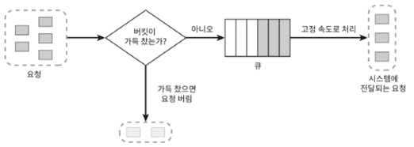
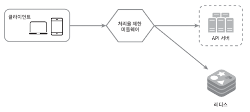
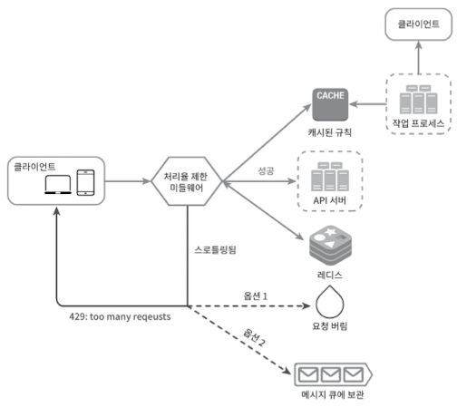
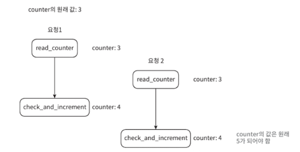
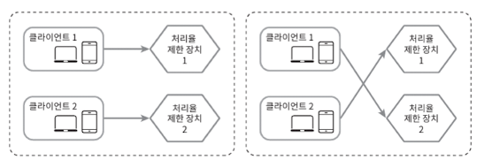
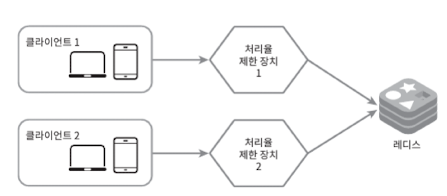

# 4장 처리율 제한 장치의 설계

네트워크 시스템에서 처리율 제한 장치는 클라이언트 or 서비스가 보내는 트래픽의 처리율을 제어하기 위한 장치

API 욫어 횟수가 제한 장치에 정의된 임계치를 넘어서면 추가로 도달한 모든 호출은 처리가 중단된다.

ex)

1. 사용자는 초당 2회 이상 새 글을 올릴 수 없다.
2. 같은 IP 주소로는 하루 10개 이상의 계정을 생성할 수 없다.
3. 같은 디바이스로는 주당 5회 이상 리워드를 요청할 수 없다.

DoS 공격에 의한 자원 고갈 방지

## 1단계 문제 이해 및 설계 범위 확정

질문

**지원자:** 어떤 종류의 처리율 제한 장치를 설계해야 하나요? 클라이언트 측 제한 장치입니까, 아니면 서버 측 제한 장치입니까?
면접관: 좋은 질문이에요. 서버측 API를 위한 장치를 설계한다고 가정합시다.
지원자: 어떤 기준을 사용해서 API 호출을 제어해야 할까요? IP 주소를 사용해야 하나요? 아니면 사용자 ID? 아니면 생각하는 다른 어떤 기준이 있습니까?
면접관: 다양한 형태의 제어 규칙(throttling rules)을 정의할 수 있도록 하는, 유연한 시스템이어야 합니다.
지원자: 시스템 규모는 어느 정도여야 할까요? 스타트업 정도 회사를 위한 시스템입니까 아니면 사용자가 많은 큰 기업을 위한 제품입니까?
면접관: 설계할 시스템은 대규모 요청을 처리할 수 있어야 합니다.
지원자: 시스템이 분산 환경에서 동작해야 하나요?
면접관: 그렇습니다.

지원자: 이 처리율 제한 장치는 독립된 서비스입니까 아니면 애플리케이션 코
드에 포함될 수도 있습니까?
면접관: 그 결정은 본인이 내려주시면 되겠습니다.
지원자: 사용자의 요청이 처리율 제한 장치에 의해 걸러진 경우 사용자에게 그 사실을 알려야 하나요?
면접관: 그렇습니다.

요구사항

- 설정된 처리율을 초과하는 요청은 정확하게 차단.
- 가능한 적은 메모리를 써야함.
- 분산형 처리율 제한: 하나의 처리율 제한 장치를 여러 서버나 프로세스에서 공유할 수 있어야함
- 높은 결함 감내성: 제한 장치에 장애가 생기더라도 전체 시스템에 영향을 주어서는 안 된다.

## 2단계 개략적 설계안 제시 및 동의 구하기

### 처리율 제한 장치는 어디에 둘 것인가?

서버에 하는게 맞음. 위변조가 쉽고, 우리도 curld을 사용하여 요청할 수 있으니

하지만 미들웨어를 둔다면? 서버에서는 신경쓸 필요가 없음

과한 요청이 왔을 때 미들웨어가 막고 클라이언트는 429 HTTP 코드를 반환

보통 MSA 에서는 API Gateway라 불리는 컴포넌트에서 구현된다.

API 게이트웨이는 처리율 제한, SSL 종단, 사용자 인증, IP 허용 목록 관리 등 완전 위탁관리형 서비스

하지만 서버에 두나 게이트웨이에 두나 정답은 없다.

처리율 제한 서비스를 직접 만드는 데 시간, 인력이 부족하다면 상용 API 게이트웨이를 쓰는 것 추천

### 처리율 제한 알고리즘

- 토큰 버킷
- 누출 버킷
- 고정 윈도 카운터
- 이동 윈도 로그
- 이동 윈도 카운터

### 토큰 버킷 알고리즘

인터넷 기업들이 보편적으로 사용하고 있음

아마존, 스트라이프가 API 요청을 위 알고리즘을 씀

통상적으로 API 엔드포인트마다 별도의 버킷을 둠

입장권과 같다고 생각하면 됨

토큰 버킷 알고리즘은 2개 인자를 받음

버킷 크기: 버킷에 담을 수 있는 토큰의 최대 개수

토큰 공급률: 초당 몇 개의 토큰이 버킷에 공급되는가

### 누출 버킷 알고리즘

FIFO Queue

큐가 빈자리가 있다면 요청 추가, 없다면 버림

지정된 시간마다 큐에서 요청을 꺼내어 처리

누출 버킷 알고리즘은 2개 인자를 받음

버킷크기: 큐 사이즈와 같은 값

처리율: 지정된 시간당 몇 개의 항목을 처리할지 지정하는 값

### 고정 윈도 카운터 알고리즘

타임라인을 고정된 간격의 윈도로 나누고, 각 윈도마다 카운터를 붙인다.

요청이 접수될 때마다 이 카운터의 값은 1씩 증가한다.

이 카운터의 값이 사전에 설정된 임계치에 도달하면 새로운 요청은 새 윈도가 열릴 때까지 버려진다.

일반적인 처리율 제한 미들웨어는 캐시를 사용하는 Redis를 사용한다.

클라이언트가 처리율 제한 미들웨어에게 요청을 보낸다.

처리율 제한 미들웨어는 레디스의 지정 버킷에서 카운터를 가져와 한도에 도달했는지 아닌지 검사한다.

## 3단계 상세 설계

처리율 제한 규칙

### 처리율 한도 초과 트래픽의 처리

### 분산 환경에서의 처리율 제한 장치의 구현

두 가지 문제를 풀어야함

1. 경쟁 조건
2. 동기화

경쟁 조건이 발생할 수 있음

요청 2는 카운터가 5가 되어야함.

위 동시성 이슈를 해결하는 가장 널리 알려진 방법은 ‘락’

하지만 락은 성능을 떨어뜨리므로 루아 스크립트 혹은 정렬 집합을 써야함

### 동기화 이슈

정말 동시에 요청할 경우 서로의 처리율 제한 장치를 모르는 상태로 처리된다.

1 → 1, 2 → 2로만 요청하도록 고정세션을 할 경우 확장성에 불리함

서로 동기화하면서 서로한테 막 보낼 수 있도록 해야함

