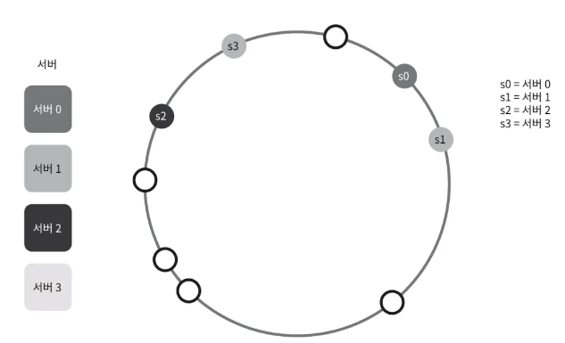
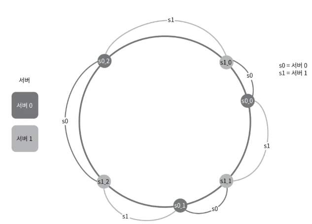

# 5장. 안정 해시

### 5장: 안정 해시 설계

일반적으로 해시 % n 방식으로 서버에 데이터를 분산시키면 서버 하나가 죽을 경우 상당한 문제가 발생함. 트래픽이 고르게 분포되지 않을 뿐만 아니라 대부분의 캐시 클라이언트가 잘못된 서버에 접근하게 됨.

이러한 문제를 해결하기 위한 방법이 **안정 해시(Consistent Hashing)**. 안정 해시는 서버 하나가 추가되거나 제거되었을 때도 대부분의 데이터가 유지될 수 있도록 설계되어 캐시 미스를 줄이는 효과가 있음.

### 안정 해시의 기본 원리

안정 해시에서는 해시 링을 이용하여 데이터(키)를 분산시킴. 이때 데이터는 항상 바로 인접한 서버에 할당됨. 하지만 이 방식에는 몇 가지 문제가 있음.

1. **불균형한 파티션 크기**: 각 서버 간의 파티션(서버 사이의 해시 공간)이 균등하지 않게 되면서 일부 서버에 데이터가 몰리는 현상이 발생할 수 있음.
2. **데이터 불균형**: 예를 들어 서버 3과 서버 1은 데이터가 거의 없는데 서버 2는 너무 많은 데이터를 갖고 있을 수 있습니다. 이러한 불균형은 시스템 성능에 문제를 일으킬 수 있음.

### 가상노드

### 가상 노드로 해결하기

이 문제를 해결하기 위해 **가상 노드(Virtual Node)** 개념이 도입됨. 가상 노드는 실제 서버를 여러 개의 가상 위치에 매핑하는 방식으로 해시 링에서 각 서버의 역할을 더욱 균일하게 분배할 수 있음.

- 예를 들어 `s0_1`, `s0_2`, `s0_3`은 모두 실제 서버 `s0`을 가리킴.
- 가상 노드가 많을수록 데이터 분배가 균등해지지만, 그만큼 관리해야 할 가상 노드가 많아지기 때문에 시스템 자원의 트레이드오프가 필요함.

시스템 요구사항에 맞게 가상 노드의 수를 조절하여 적절히 균형을 맞추는 것이 중요함.