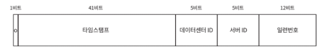

# 7장 분산 시스템을 위한 유일 ID 생성기 설계

분산 RDB환경에서 Auto Increment 방식은 당연히 사용할 수 없음

Q. ID는 어떤 특성을 갖나요?

A. ID는 유일해야하고, 정렬 가능해야합니다.

Q. 새로운 레코드에 붙일 ID는 항상 1만큼 커야하나요?

A. 항상 1은 아니지만 새로운 것은 이전것 보단 커야함

Q. ID는 숫자로만 구성되나요?

A. Yes

Q. 시스템 규모는 어느정도입니까?

A. 초당 10,000 ID를 생성할 수 있어야함

### 방법1. 다중 마스터 복제

Auto Increment 만큼 사용하되 증가 수를 1이 아닌 k만큼 증가시킴.

여기서 k는 서버의 개수

그럴듯해보이지만 여러 데이터 센터에 걸쳐 규모를 늘리기 어려움

시간 흐름에 맞추어 커지도록 보장할 수 없음

서버 추가, 삭제시에도 번거로움

### 방법2. UUID

단순하고 그럴듯해보임

시간 순으로 정렬할 수 없으며 숫자가 아닌 값이 들어옴

### 방법3. 티켓 서버

유일성이 보장되는 ID를 만들어 내는 데 쓰일 수 있는 방법

플리커는 분산 기본 키를 만들어내기 위해 이 기술 사용

Auto Increment를 만드는 서버를 따로 두고 이를 다른 서버들이 의존하도록 설계

SPOF 문제. 하나가 문제 생기면 모두 영향을 받음

### 방법4. 스노플레이크 복합키 접근법

Id를 시간 순서대로 등록해야하며 동시에 여러개의 서버가, 분산 키-값 데이터 저장소에 id를 넣는방법

1. ID는 유일해야 한다.
2. ID는 숫자로만 구성되어야 한다.
3. ID는 64비트로 표현될 수 있는 값이어야 한다.
4. IID는 발급 날짜에 따라 정렬 가능해야 한다.
5. 초당 10,000개의 ID를 만들 수 있어야 한다.

### 트위터 스노플레이크 접근법

사인(sign) 비트: 1비트 할당. 여유 비트, 음수 양수 비트로 사용할 수 있음

타임스탬프: 41비트 할당.

데이터센터 ID: 5비트 할당. 2^5, 32개 데이터 센터 지원할 수 있음

서버 ID: 5비트 할당. 2^5, 32개 서버 사용할 수 있음

일련번호: 12비트 할당: 여기서 auto increament, 1밀리초 경과할떄마다 0으로 초기화

2^41 - 1 2조1990억… 밀리초 → 약 69년

69년이 맥스이니까 그 후 갱신해야함

고가용성에서 ID 생성기는 필수 컴포넌트

하지만 이는 모든 대륙에서 같은 시간을 가정한 것임. 상황에 따라 고려할 것

동시성이 낮다면 타임스탬프를 늘리고 일련번호를 줄이는게 좀 더 효과적일수도 있음