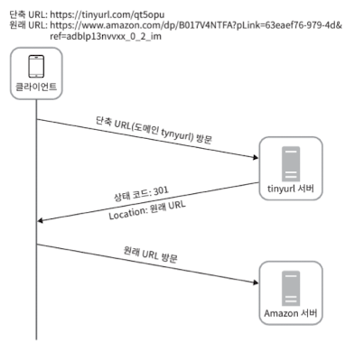
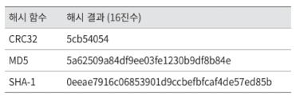
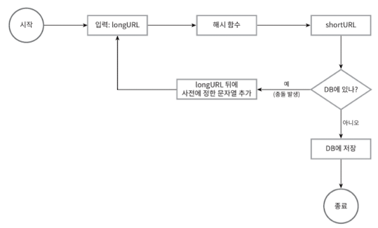
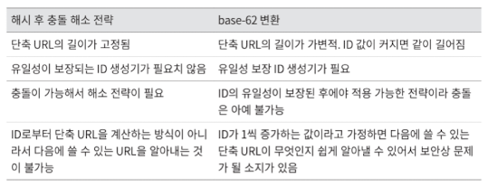

# 8장 단축 URL

Q. URL 단축키가 어떻게 동작해야하나요?

A. https://www.systeminterview.com/q=chatsystem&c=loggedin&v=v3&/=long이 입력으로 주어졌다고 해 봅시다. 이 서비스는 https:/inyurl.comy7ke-ocwj와 같은 단축 URL을 결과로 제공해야 합니다. 이 URL에 접속하면 원래 URL로 갈 수도 있어야 하죠.

Q. 트래픽 규모는 어느정도인가요?

A. 매일 1억 개의 단축 URL을 만들어 낼 수 있어야 합니다.

Q. 단축 URL의 길이는 어느정도여야 하나요?

A. 짧으면 짧을수록 좋습니다.

Q. 단축 URL에 포함될 문자에 제한이 있나요?

A. 숫자 0 ~9, 영문자 a ~ z, A ~ Z까지만 가능합니다.

Q. 단축된 URL을 시스템에서 지우거나 갱신할 수 있나요?

A. 시스템을 단순화하기 위해 삭제나 갱신을 할 수 없습니다.

요구사항

1. URL 단축: 주어진 긴 URL을 훨씬 짧게 줄인다.
2. URL 리디렉션(redirection): 축약된 URL로 HTTP 요청이 오면 원래 URL로 안내
3. 높은 가용성과 규모 확장성, 그리고 장애 감내가 요구됨

개략적 추정

- 쓰기 연산: 매일 1억 개의 단축 URL 생성
- 초당 쓰기 연산: 1억/24/3600= 1160
- 읽기 연산: 읽기 연산과 쓰기 연산 비율은 10:1이라고 하자. 그 경우 읽기 연산은 초당 11,600회 발생한다
- URL 단축 서비스를 10년간 운영한다고 가정하면 1억(100million)× 365 x 10=3650억(365billion) 개의 레코드를 보관해야 한다.
- 축약 전 URL의 평균 길이는 100이라고 하자.
- 따라서 10년 동안 필요한 저장 용량은 3650억 X 100바이트= 36.5TB이다.

변환시 아래와 같은 API를 호출

POST /api/v1/data/shorten

인자: {longUrl: longURLstring}

반환: 단축 URL

URL 다이렉션용 엔드포인트

GET /api/v1/shotUrl

반환: HTTP 리다이렉션 목적지가 될 원래 URL

리다이렉션은 2개로 나뉨. 301, 302

301 - 영구적 리다이렉트, 영구적이므로 브라우저는 응답을 캐시함

302 - 일시적 리다이렉트

부하를 줄이기위해선 301이, 클릭 발생률과 발생 위치 추적에는 302가 유리

가장 직관적인 방법은 해시테이블을 사용하여 <단축 URL, 원래 URL>로 구성하는 것

하지만 해시테이블은 비싸기 떄문에 RDB에 pk(id), shortURL, longURL로 두는 것이 일반적

### 해시 방법

a ~ z + A ~ Z + 0 ~ 9 = 62

shortURL의 길이를 정하기 위해서는 62^n ≥ 3650억인 n의 최솟값을 찾아야함

n =7 일때 약 3.5조개 가능하므로 길이는 7

잘 알려져있는 해시함수 사용하자

하지만 이는 길이가 8이므로 하나를 줄여야하고, 그럴 수록 충돌할 확률이 올라감

그렇다고 위와 같이 매번 검사하기엔 DB에 질의해야하므로 오버헤드가 큼

이럴 땐 **`볼륨 필터`**를 사용

‘있다’라고 말했을 때 틀리 수도 있지만 ‘없다’라고 할 때 100 정확함

### base-62변환

말그대로 62진수 연산

테이블의 id는 7장의 분산화된 환경에서의 ID 생성기 활용