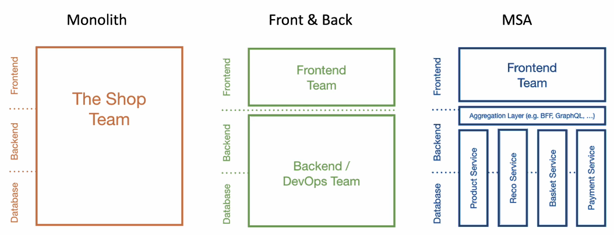
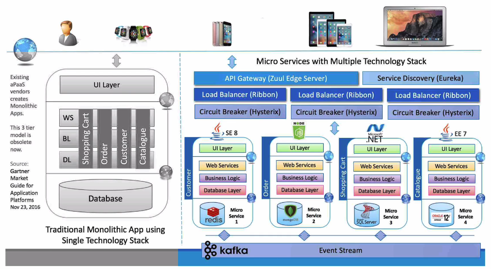
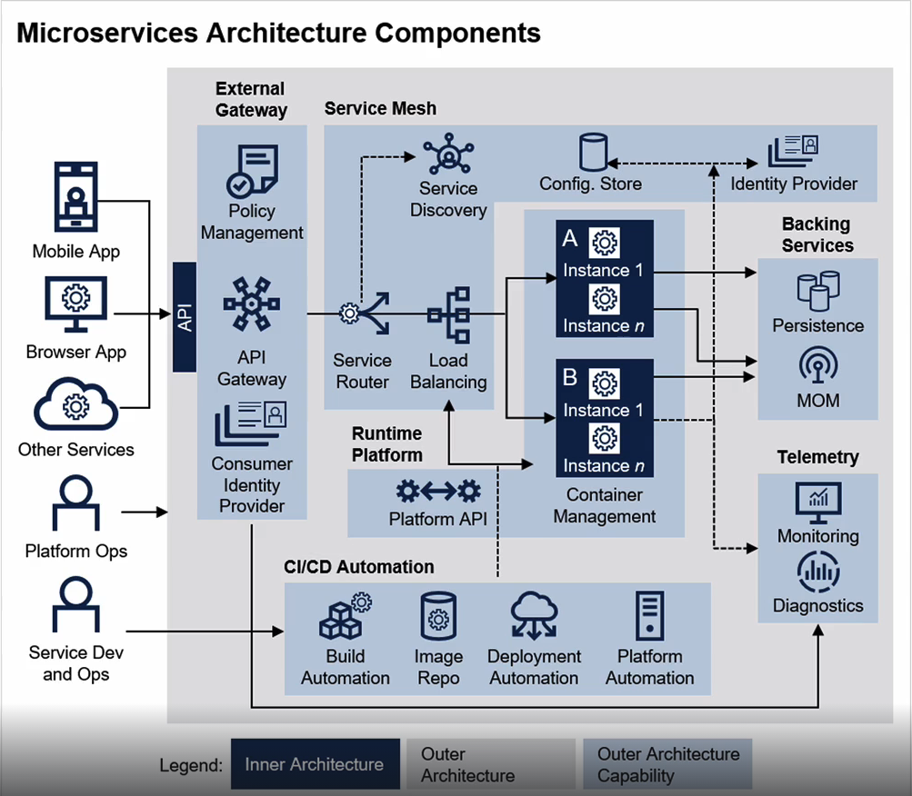
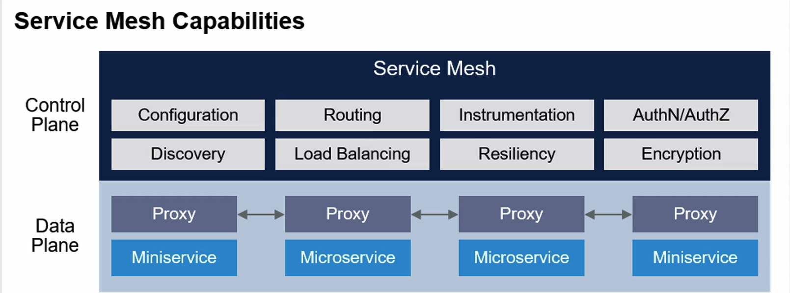

# 1장. MSA 개요

# Cloud Native Architecture

### 확장 가능한 아키텍처

시스템의 수평적 확정에 유연

확장된 서버로 시스템의 부하 분산, 가용성 보장

시스템 또는, 서비스 애플리케이션 단위의 패키지(컨테이너 기반 패키지)

모니터링

### 탄력적 아키텍처

서비스 생성 - 통합 - 배포, 비즈니스 환경 변화에 대응 시간 단축

분활된 서비스 구조

무상태 통신 프로토콜

서비스의 추가와 삭제 자동으로 감지

변경된 서비스 요청에 따라 서비스 요청 처리(동적 처리)

### 장애 격리

특정  서스에 오류가 바생해도 다른 서비스에 영향을 주지 않음

## Cloud Native Application

1. Microservices
2. CI/CD
3. DevOps
4. Containers

# 12 Factors

1. BASE CODE

   자체 repo에 저장된 각 마이크로 서비스에 대한 단일 코드 베이스

   버전을 제어하기 위한 목적. 코드를 한 곳에서 배포하는 게 주 목적

2. 종속성

   각 마이크로 서비스는 자체 종속성을 가지고 패키징되어 전체 시스템에 영향을 주지 않은 상태로 변경되고, 수정할 수 있어야 함

3. 구성요소

   코드 내에서 설정을 정하는 것이 아닌, 외부에서 구성 관리 도구를 통해 제어

4. 서비스 지원

   보조 서비스(DB, Cache, Message, Broker)를 이용해서 MSA가 가져야될 기능들을 추가로 지원할 수 있는 것을 의미

   실제 프로그램에서 필요한 백킹 시스템 리소스를 분리함으로써 서로 상호가능한 서비스 자체를 우리가 의존성 없이 작업할 수 있음

5. build, Redlease, 실행환경의 분리

   실행 단계와 옮기는 과정을 엄격하게 분리해야 함

   각각은 고유한 아이디로 태그를 가져야하며 롤백 기능을 지원해야함

6. Processes

   각각의 MSA는 실행 중인 다른 서비스와 분리된 채 자체 프로세스에서 운영되어야함

7. Prot Binding

   각각의 MSA는 자체 포트에서 노출되는 인터페이스 및 기능과 함께 자체에 포함되어있어야함

8. 동시성

   하나의 서비스가 여러가지 인스턴스에 동일한 형태로 복사되어 운영함으로써 부하 분산.

9. Disposability

   서비스 인스턴스 자체가 삭제가 가능해야 함. 확장성 기회를 높여야함. 정상적으로 종료가 가능해야 함

10. 개발 단계와 배포 단계의 구분

    환경 자체를 다른 쪽에 있는 작업과 종속되지 않은 상태에서 유지해야 함

11. LOGS

    MSA에 의해 생성된 로그를 이벤트 스트림으로 처리해야 함

12. 관리자 프로세스

    현재 어떤 상태로 사용되고 있는지 파악하기 위한 도구가 필요함

## 12 Factors + 3

1. API-first
2. Telemetry
3. Authentication and authorization

# Monolithic vs MSA

Monolithic: 모든 로직이 1개의 어플리케이션에서 동작. 서로 의존

MSA: 서비스끼리 분리, 유지보수나 변경 사항을 적용하는데 훨씬 유리

Martin Fowler - 각각의 MicroService들은 최소한의 중앙 집중식 관리가 되어야하며 서로 다른 프로그래밍 언어와 서로 다른 데이터 저장 기술을 사용할 수 있다. 독립적인 언어, 독립적인 DB를 사용할 수 있다.

## Monolith vs Front & Nach vs Microservice Architectur

### Microservice 원칙 (2002년 Amazon, 제프 베조스의 이메일)

- **모든 팀은 데이터를 서비스 인터페이스를 통해 노출해야 한다.**

  각 팀은 자신이 소유한 데이터와 기능을 다른 팀이 사용할 수 있도록 명확하게 정의된 서비스 인터페이스를 통해 외부로 공개해야 함.

- **팀 간의 모든 통신은 서비스 인터페이스를 통해 이루어져야 한다.**

  직접적인 데이터베이스 호출, 메모리 공유, 혹은 파일 기반 접근 등 다른 형태의 프로세스 간 통신은 금지. 모든 통신은 네트워크를 통한 서비스 호출 방식이어야 함.

- **다른 형태의 프로세스 간 통신은 허용되지 않는다.**

  서비스 간의 데이터 공유는 반드시 서비스 인터페이스를 통해 이루어져야 하며, 직접적인 데이터 접근은 불가. 즉, 백도어나 비공식적인 데이터 접근 방식은 모두 차단.

- **어떤 기술을 사용하든 상관없다.**

  HTTP, CORBA, Pub/Sub, 혹은 커스텀 프로토콜 등 팀마다 각자의 필요와 상황에 따라 적합한 기술을 자유롭게 사용할 수 있음.

- **모든 서비스 인터페이스는 외부에서 접근 가능해야 한다.**

  각 팀은 자신들의 서비스를 외부 개발자들이 사용할 수 있도록 설계해야 하며, 인터페이스가 외부화(externalizable)될 수 있도록 준비해야 함.

### Microservice의 특징 정리

1. Challenges - 기존과는 다른 방식으로 해야함
2. Small Well Chosen Deployable Units - 독립적으로 배포 가능한 형태의 작은 서비스로 이루어짐
3. Bounded Context -서비스 경계를 잘 구분해야하고, 하나의 서비스가 여러개로, 여러개가 한개로 이루어질 수 있음
4. RESTful - 서로 상태의 대해서 Rest하게 통신해야함
5. Configuration Management - 환경 설정은 코드 내에서 설정하는 것이 아니라 외부에서 관리해야함
6. Cloud Enabled - CloudNative 기술을 사용할 것
7. Dynamic Scale Up And Scale Down - 동적으로 스케일업, 스케일 다운
8. CI/CD
9. Visibility

### 모든 서비스가 MSA여야하는가?

Q1. 기존 개발 대비 얼마나 바뀌어야하나?

Q2. 독립적인 개발 및 운영하는 라이프 사이클. 서비스 경계

Q3. 독립적인 확장성

Q4. 격리된 오류. 서로간 영향을 주지 않음

Q5. 외부 종속성과의 상호작용을 단순화 시킬 수 있는 가

Q6. 여러 언어를 사용할 수 있는가

### SOA VS MSA

SOA - 재사용을 통한 비용 절감

MSA - 서비스 간의 결합도를 낮추어 변화에 능동적으로 대응

각각의 독립된 서비스가 노출된 REST API 사용

### MSA 표준 구성 요소

### Service Mesh

서비스간 내부 통신을 의미

### Spring Cloud란

MSA를 지원하는 FrameWork

Spring Boot 버전과 Spring Cloud 버전이 호환되는 것을 꼭 확인해야함

Spring Cloud Config Server

환경 설정 관리

Naming Server (Eureka)

서비스의 등록과 위치 정보 확인, 검색과 같은 서비스를 위해서 Nefix의 Euraka가 필요함

서버에 들어온 요청 정보를 분산 (로드밸런싱, 게이트웨이)

~~Ribbon (Client Side) + Nefilx의 줄 (이전 버전)~~

Spring Cloud Gateway (최신 버전)

각 서비스간 통신

FeignClient

시각화, 모니터링

Zipkin Distributed Tracing

Netflix API gateway

장애 발생시 복구, 회복 패턴

Hystrix (Netflix)